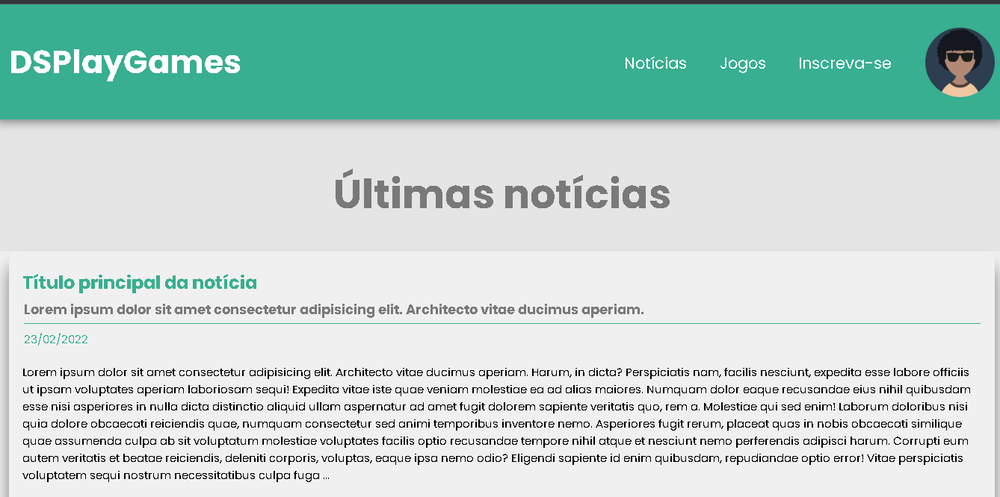

#DESAFIO: DSPlayGames responsivo

##DevSuperior Prof. Nélio Alves

!
!

##Formação Desenvolvedor Moderno
##Módulo: HTML e CSS
##Capítulo: Estudo de caso responsividade

## 🚀 Tecnologias:

- HTML
- CSS

## 🌐 Contato

[🔗LinkedIn](https://www.linkedin.com/in/jorge-sidney-1b9696238/)